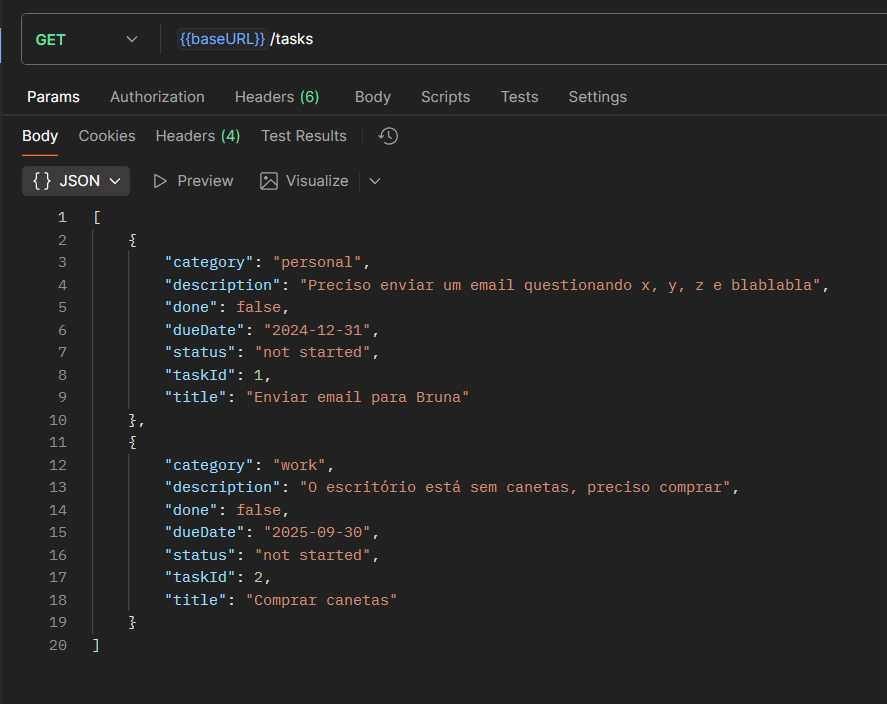
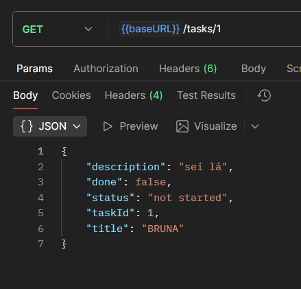
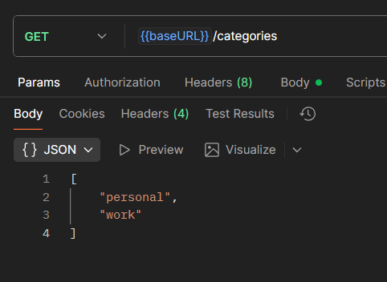
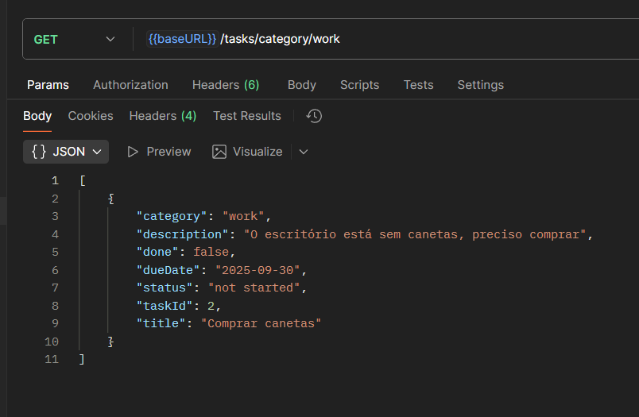
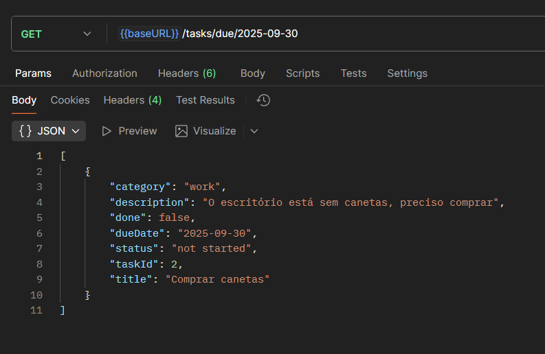
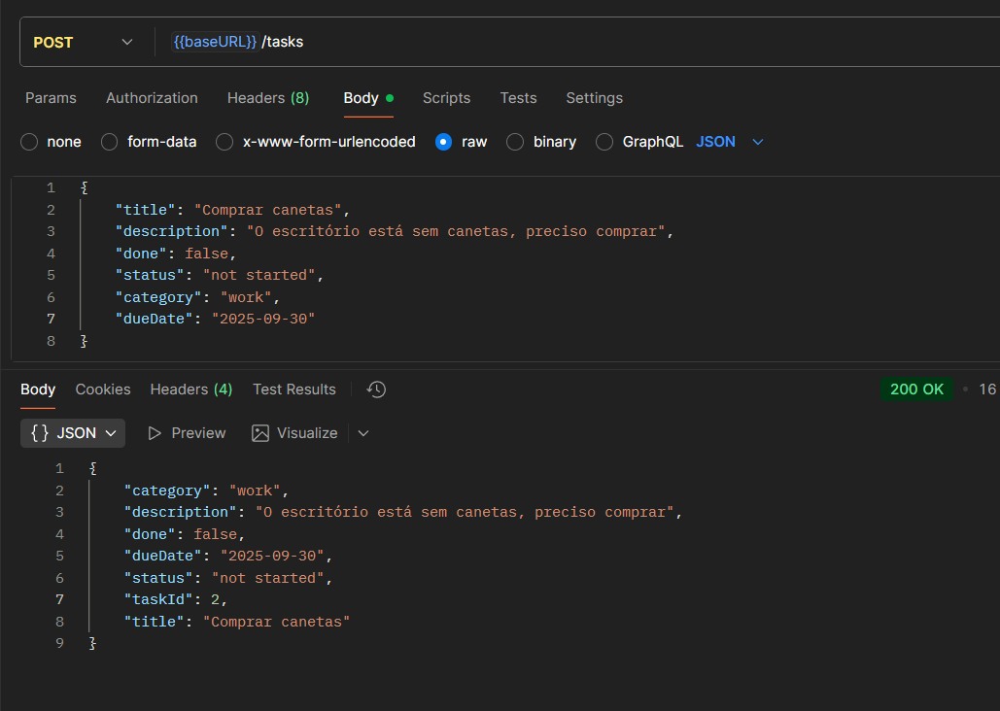
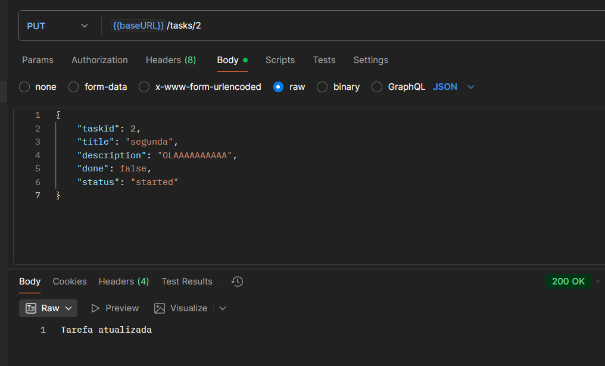
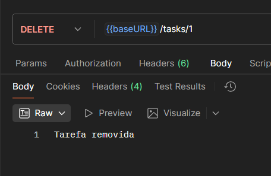
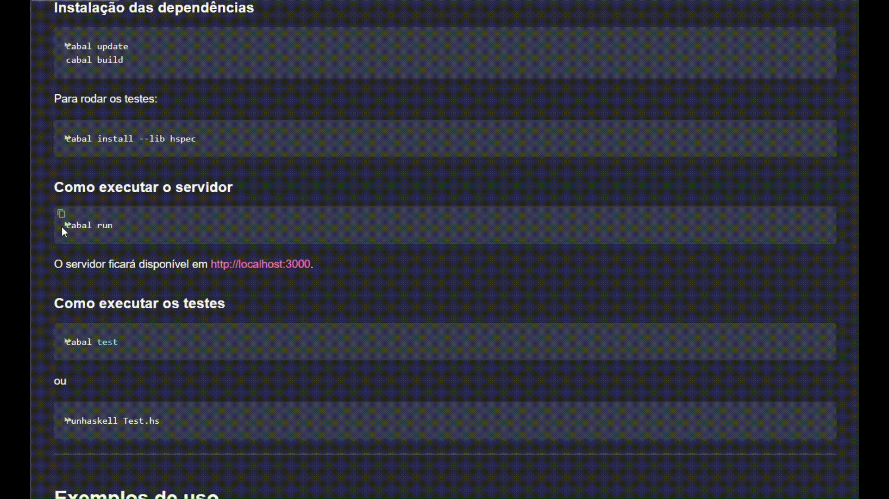

[](https://classroom.github.com/a/7NMOLXjY)

# API RESTful To-Do List com Scotty e SQLite

## Identificação

- **Nome:** Bruna
- **Curso:** Sistemas de Informação

---

## Tema

API RESTful para gerenciamento de tarefas (To-Do List) usando Scotty e SQLite.  
Permite criar, listar, atualizar e remover tarefas, além de categorizar, definir status e datas de vencimento.

---

## Processo de desenvolvimento

O projeto foi desenvolvido em etapas, conforme o planejamento:

- Inicialmente, implementei os endpoints CRUD usando Scotty.
- Em seguida, adicionei persistência com SQLite, criando funções auxiliares para manipulação do banco.
- Escrevi testes unitários para as funções principais, utilizando Hspec e banco em memória.
- Adicionei funcionalidades extras: sistema de categorias e datas de vencimento.
- Testei a aplicação localmente, corrigi bugs e refatorei para separar lógica em módulos.
- O desenvolvimento foi incremental, com testes e ajustes a cada etapa.
- Consultei a documentação oficial dos pacotes Scotty e sqlite-simple, além de exemplos da aula sobre Scotty.
- Para testar os endpoints da API, utilizei o Postman.

---

## Orientações para execução

### Requisitos

- [GHC](https://www.haskell.org/ghc/) (>= 8.0)
- [Cabal](https://www.haskell.org/cabal/) (>= 2.0)
- SQLite3 instalado no sistema

### Instalação das dependências

```sh
cabal update
cabal build
```

Para rodar os testes:

```sh
cabal install --lib hspec
```

### Como executar o servidor

```sh
cabal run
```

O servidor ficará disponível em [http://localhost:3000](http://localhost:3000).

### Como executar os testes

```sh
cabal test
```

ou

```sh
runhaskell Test.hs
```

---

## Exemplos de uso

- **GET** `/tasks`  
  Lista todas as tarefas.
  

- **GET** `/tasks/:id`  
  Busca uma tarefa pelo id.
  

- **GET** `/categories`  
  Lista todas as categorias cadastradas.
  

- **GET** `/tasks/category/:category`  
  Lista todas as tarefas de uma categoria.
  

- **GET** `/tasks/due/:date`  
  Lista todas as tarefas com determinada data de vencimento.
  

- **POST** `/tasks`  
  Cria uma nova tarefa.  
  

- **PUT** `/tasks/:id`  
  Atualiza uma tarefa existente.
  

- **DELETE** `/tasks/:id`  
  Remove uma tarefa.
  

---

## Demonstração em vídeo



---

## Resultado final

- O campo `taskId` é gerado automaticamente pelo backend.
- Cada tarefa possui uma categoria (`category`) e uma data de vencimento (`dueDate`).

---

## Referências

- [Documentação Scotty](https://hackage.haskell.org/package/scotty-0.22/docs/Web-Scotty.html)
- [Documentação sqlite-simple](https://hackage.haskell.org/package/sqlite-simple-0.1.0.0/docs/Database-SQLite-Simple.html)
- [Exemplo de projeto Scotty](https://liascript.github.io/course/?https://raw.githubusercontent.com/elc117/demo-scotty-codespace-2025b/main/README.md)

---
